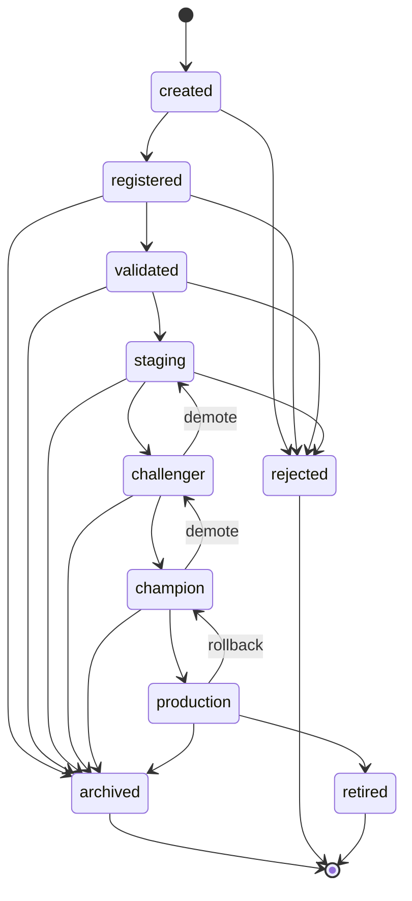

# Model Operations Subsystem (Sprint 8)

The **one authoritative** model registry + lifecycle + monitoring subsystem for CreditIQ AI,
managing both **credit** and **fraud** models. It reuses existing platform primitives — no duplicate
registries, loggers, config loaders, metadata models, or serializers.

## Reuse map (what this subsystem builds ON)

| Reused | Source |
|---|---|
| `ModelMetadata` (embedded in `ModelVersion`) | `core.schemas` (Sprint 1) |
| `ModelType` / `ProblemType` enums | `core.enums` |
| Logging (`BaseComponent.logger`, Loguru) | `logging/` |
| Config (`EngineConfig` + `base.yaml`, single loader) | `config/` (Sprint 3.5) |
| Serialization (`joblib`) | trainers/detectors |
| Exception hierarchy | `exceptions/` (extended additively) |

## Package layout (`creditiq_ai/model_operations/`)

```
domain.py            # typed domain models + LifecycleStage + transition graph   ← Phase 2a ✅
lifecycle/           # LifecycleStateMachine (validated transitions)             ← Phase 2a ✅
registry/            # authoritative ModelRegistry (register/version/search/…)   ← Phase 2b
storage/  adapters/  # Repository interfaces + JSON/in-memory impls              ← Phase 2b
lineage/             # lineage graph + traversal (parents/children/ancestry)     ← Phase 2b
promotion/ rollback/ # champion/challenger, promotion policy, safe rollback      ← Phase 3
experiments/         # ExperimentTracker iface + Local + optional MLflow adapter ← Phase 4
drift/ monitoring/ performance/ health/  # drift, prediction/perf monitoring     ← Phase 5
alerts/ audit/ reports/                   # alerting, immutable audit, reports    ← Phase 6
services/            # facades (Registry/Lifecycle/Drift/… + ModelOperations)    ← Phase 6
validators/          # metadata/integrity/transition/lineage validators          ← per phase
```

## Model lifecycle state machine (Phase 2a ✅)

Every stage change is validated; illegal transitions raise `InvalidLifecycleTransitionError`.



- **Terminal stages:** `archived`, `rejected`, `retired` (no outgoing transitions).
- **Demotion / rollback** are first-class edges (`champion → challenger`, `production → champion`).
- No-op transitions (same → same) are rejected.

## Domain models (Phase 2a ✅)

`ModelIdentity` · `ModelArtifact` · `ModelLineage` · **`ModelVersion`** (embeds the reused
`ModelMetadata`) · `ModelEvaluationSnapshot` · `ModelDeploymentRecord` · `ModelPromotionRequest` ·
`ModelRollbackRequest` · `AuditEvent`. All are `extra="forbid"` Pydantic models.
Monitoring/drift/health/alert domain models arrive with their phases.

## Design decisions

- **One authoritative registry** — the empty `registry/` scaffolds contained no implementation, so
  `model_operations` is the single home. `ModelVersion` *embeds* `ModelMetadata` rather than
  redefining it.
- **State Machine for lifecycle** — the legal transition graph is explicit domain logic (not a
  tunable threshold), enforced centrally so no service can corrupt lifecycle state.
- **Additive exceptions** — 13 domain errors added under the existing hierarchy
  (`ModelRegistryError` parent; `MonitoringError` parent; `AuditError`).
- **Backward compatible** — new config field defaults; 108 baseline tests unchanged and passing.

## Status
**Phase 2a complete and gated.** Phases 2b–8 (storage/registry/lineage → promotion/rollback →
experiments → drift/monitoring/health → alerts/audit/reports/services → inference integration)
follow incrementally, each with its own quality-gate run.
